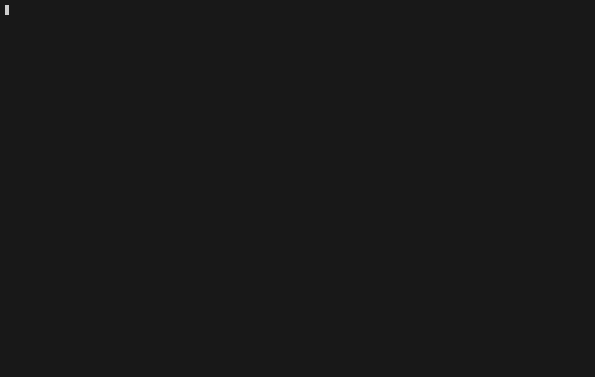

# Stackctl: Project Initializr & Task Runner

 &nbsp;&nbsp;
 &nbsp;&nbsp;


**Stackctl** is a fast, interactive Terminal User Interface (TUI) CLI for creating  application projects from framework starters, and for running project tasks from a simple task file.

Select your framework, choose dependencies and project options, and generate a ready to run project directly from your terminal. Then automate builds, releases and everyday scripts with a Taskfile-style `stackctl.yml`, `stackctl.json` or `stackctl.toml`.

Built for a keyboard first workflow, Stackctl removes the need to open a browser just to bootstrap a new application.

Powered by Go, Cobra, Bubble Tea, and official framework APIs.

**No browser. No boilerplate. Just ship. ⚡**

---

## ✨ Features

🚀 Project Initialization
  - Generate new projects using official APIs
  - Supported stacks:  
    Spring Boot  
    Quarkus   
    Micronaut


Dependencies (multi-select with search)

🛠️ Task Runner
  - Taskfile-style task files in **YAML, JSON or TOML**
  - Interactive task selector (`stackctl run`)
  - Task dependencies (run in parallel), task aliases and Go templates
  - Global and per-task `vars` and `env`

---

## 📸 Preview




---

## 🧰 Tech Stack

| Component             | Purpose                       |
| --------------------- | ----------------------------- |
| Go                    | Core language                 |
| Cobra                 | CLI commands and flags        |
| Bubble Tea            | TUI UI framework              |
| Lipgloss              | Styling                       |
| Bubbles               | UI widgets                    |
| Spring Initializr API | Metadata + project generation |

---

## 📦 Installation

### Linux and macOS

```bash
curl -fsSL https://raw.githubusercontent.com/subrotokumar/stackctl/main/scripts/install.sh | sh
```

### Windows PowerShell

```powershell
irm https://raw.githubusercontent.com/subrotokumar/stackctl/main/scripts/install.ps1 | iex
```

### Windows CMD

```cmd
curl -fsSL https://raw.githubusercontent.com/subrotokumar/stackctl/main/scripts/install.cmd -o install.cmd && install.cmd
```

### Install with Go

```bash
go install github.com/subrotokumar/stackctl@latest
```

### Manual Build Installation

You can also clone the repository and run the installation script directly:

```bash
git clone https://github.com/subrotokumar/stackctl.git
cd stackctl
go install
```

---

## 🚀 Usage

### Create a project

```bash
stackctl
```

Follow the interactive terminal UI to configure your project.
Once done, your project will be created and extracted automatically.

### Commands

| Command                              | Description                                         |
| ------------------------------------ | --------------------------------------------------- |
| `stackctl`                           | Create a new project (interactive)                  |
| `stackctl run`                       | Open the interactive task selector                  |
| `stackctl run <task>`                | Run a task                                          |
| `stackctl run <task> VAR=value`      | Run a task and override a variable                  |
| `stackctl run <task> -- <args>`      | Pass extra arguments, available as `{{.CLI_ARGS}}`  |
| `stackctl run <task> -n`             | Dry run: print commands without running them        |
| `stackctl run <task> -s`             | Silent: don't echo commands                         |
| `stackctl list` (`ls`)               | List tasks, aliases and descriptions                |
| `stackctl version` (`v`)             | Print version information                           |

Global flag: `-f, --file <path>` uses a specific task file.

---

## 🛠️ Task Runner

Stackctl looks for a task file **in the current directory** (the directory you run it from), in this order:

```
stackctl.yml  stackctl.yaml  stackctl.json  stackctl.toml
Taskfile.yml  Taskfile.yaml  Taskfile.json  Taskfile.toml
```

The structure follows [Taskfile](https://taskfile.dev), and works the same in YAML, JSON and TOML.

### Example (`stackctl.yml`)

```yaml
vars:
  APP: myapp

env:
  CGO_ENABLED: "0"

tasks:
  build:
    desc: Build the binary
    aliases: [b]
    deps: [fmt]
    cmds:
      - go build -o bin/{{.APP}} .

  fmt:
    desc: Format code
    cmds:
      - go fmt ./...

  test:
    desc: Run tests
    cmds:
      - go test ./... {{.CLI_ARGS}}

  release:
    desc: Build and tag a release
    vars:
      VERSION: "0.1.0"
    cmds:
      - task: build
      - cmd: echo "tagging v{{.VERSION}}"
        silent: true
      - git tag v{{.VERSION}}
```

```bash
stackctl run build
stackctl run b                      # alias
stackctl run release VERSION=1.2.0  # override a var
stackctl run test -- -v -run TestX  # extra args
```

### The same task in TOML

```toml
[vars]
APP = "myapp"

[tasks.build]
desc = "Build the binary"
aliases = ["b"]
deps = ["fmt"]
cmds = ["go build -o bin/{{.APP}} ."]

[tasks.release]
cmds = [
  { task = "build" },
  { cmd = "echo tagging", silent = true },
]
```

### Task fields

| Field          | Description                                                        |
| -------------- | ------------------------------------------------------------------ |
| `desc`         | Description shown in `list` and the selector                       |
| `aliases`      | Alternative names for the task                                     |
| `cmd`          | A single command (shortcut, runs before `cmds`)                    |
| `cmds`         | Commands to run in order. Each is a string or an object (see below) |
| `deps`         | Tasks to run **before** this one, in parallel, once per run        |
| `dir`          | Working directory, relative to the task file                       |
| `vars`         | Template variables for this task                                   |
| `env`          | Environment variables for this task                                |
| `silent`       | Don't echo commands                                                |
| `ignore_error` | Continue when a command fails                                      |

Entries in `cmds` can be a plain string, or an object:

```yaml
cmds:
  - go test ./...
  - task: build              # call another task
  - cmd: echo done
    silent: true
    ignore_error: true
```

Top level keys: `version`, `vars`, `env`, `tasks`.

### Variables and templates

- **`vars`** are template variables, used as `{{.NAME}}` inside the task file.
- **`env`** are environment variables, passed to your commands as `$NAME`.
- Priority for `vars` (later wins): global, task, command line (`VAR=value`).
- Templates use Go's `text/template` syntax, including `{{if}}`, `{{range}}`, `eq` and `printf`. They are processed in `cmd`/`cmds`, `dir` and `env` values.
- `{{.CLI_ARGS}}` holds everything passed after `--`.
- Quote YAML values that start with `{{`.

### Interactive selector

Run `stackctl run` without a task name:

```
Tasks
Select a task to run
❯ build    Build the binary
  fmt      Format code
  release  Build and tag a release
```

| Action  | Key             |
| ------- | --------------- |
| Move    | ↑ ↓ or j k      |
| First / last | g / G      |
| Run     | Enter           |
| Cancel  | Esc, q, Ctrl+C  |

---

## ⌨️ Controls (project creation)

| Action            | Key        |
| ----------------- | ---------- |
| Navigate          | ↑ ↓ or j k |
| Select / Continue | Enter      |
| Go Back           | Esc        |
| Multi Select      | Space      |
| Quit              | Ctrl + C   |

---

## 🤝 Contributing

Contributions are welcome! ❤️
Please open an issue or submit a pull request.

---

## 📝 License

This project is licensed under the **MIT License**.
See the `LICENSE` file for more details.

---

## ⭐ Support

If you like this project:

* ⭐ Star the repo
* 🔁 Share with other Spring + Go developers